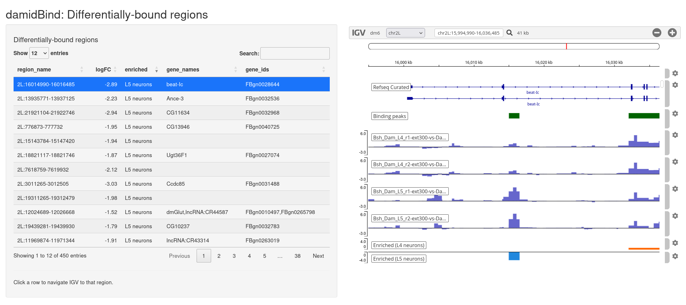

```{r setup, include=FALSE}
knitr::opts_chunk$set(
    comment = "##",
    warning = FALSE,
    dev = "png"
)
library(DT)
```

# Introduction

DamID [@Steensel2000; @Steensel2001] is a highly-sensitive means to profile the genome-wide association of proteins with chromatin in living eukaryotic cells, without fixation or the use of antibodies. Cell-type specific techniques such as Targeted DamID [@Southall2013; @Marshall2016] to profile protein binding, and CATaDA [@Aughey2018] to profile chromatin accessibility, have made the technique an extremely powerful tool to understand the binding of transcription factors, chromatin proteins, RNA polymerase and chromatin changes during development and disease.

Despite the technique's growing popularity and adoption, no formal analysis pipeline or R package exists to analyse and explore differential DamID binding, gene transcription or chromatin accessibility between two conditions. The `r Biocpkg('damidBind')` package provides this functionality.

`r Biocpkg('damidBind')` imports processed data from DamID-seq experiments in the form of binding bedgraphs and GFF peak calls. After optionally normalising data, combining peaks across replicates and determining per-replicate peak occupancy, the package links bound loci to nearby genes. It then uses either `r Biocpkg("limma")` (for conventional log2 ratio DamID binding data) or `r Biocpkg("NOIseq")` (for counts-based CATaDa chromatin accessibility data) to identify differentially-enriched regions between two conditions. The package provides a number of visualisation tools (volcano plots, GO enrichment plots, Venn diagrams) for downstream data exploration and analysis. An interactive IGV genome browser interface (powered by `r CRANpkg("Shiny")` and `r Biocpkg("igvShiny")`) allows users to rapidly and intuitively assess significant differentially-bound regions.

Although extensive customisation options are available if required, much of the data handling by `r Biocpkg('damidBind')` is taken care of automatically, with sensible defaults assumed. To move from loading raw data to visualising differentially-enriched regions on a volcano plot or browsing enriched regions in an interactive IGV window is a simple three command procedure.

# Installation

To install from github, use:

``` r
# Install Bioconductor
if (!require("BiocManager", quietly = TRUE))
    install.packages("BiocManager")

# Then install the damidBind package
BiocManager::install("marshall-lab/damidBind")
```

# Quick start guide

Using `r Biocpkg('damidBind')`, in eight easy steps:

```{r quickstart, eval=FALSE, echo=TRUE}
## Example code only, not run:

# Load up the data (use load_data_genes() for RNA Polymerase occupancy data)
input <- load_data_peaks(
    binding_profiles_path = "path/to/binding_profile_bedgraphs",
    peaks_path = "path/to/peak_gffs_or_beds"
) # add quantile_norm = TRUE if appropriate

# Deterimine differential binding  (use differential_accesibility() for CATaDa chromatin accessibility data)
input.diff <- differential_binding(
    input,
    cond = c(
        "Condition 1 identifying string in filenames",
        "Condition 2 identifying string in filenames"
    )
)

# The result 'input.diff' is a formal S4 object.
# You can see a summary by simply typing its name:
input.diff

# View the proporition of differentially bound loci
plot_venn(input.diff)

# Plot the differential binding, labelling associated genes with outliers
plot_volcano(input.diff)

# Analyse GO enrichment in peaks associated with one condition
analyse_go_enrichment(
    input.diff,
    direction = "Condition 1 identifier set with differential_binding() above"
)

# View the differentially bound regions in an IGV browser window, with an interactive table of bound regions
browse_igv_regions(input.diff)

# Apply additional functions on the differential binding results
my_custom_function(analysisTable(input.diff))
```

# Sample data examples

## Sample input data (provided within the package)

`r Biocpkg('damidBind')` provides a simple, truncated dataset with the package for immediate testing. Owing to package space, this sample dataset uses only *Drosophila melanogaster* chromosome 2L binding, and should not be used for any actual analysis.

## Sample input data (provided online through a Zenodo repository)

[Three previously-published sample datasets](https://doi.org/10.5281/zenodo.16649477) have been deposited in Zenodo and made available for fully exploring the features and capabilities of `r Biocpkg('damidBind')`:

-   Bsh transcription factor binding in L4 and L5 neurons of the *Drosophila* lamina [@Xu2024]
-   CATaDa chromatin accessibility data in L4 and L5 neurons [@Xu2024]
-   RNA Polymerase II occupancy in *Drosophila* larval neural stem cells and adult neurons. [@Marshall2017]

Processed files (incl. binding profiles and peaks files) are provided for all datasets.

# Data preparation

## Input data format

`r Biocpkg('damidBind')` takes as input:

-   Genome-wide binding profile tracks in BEDGRAPH format (external files) or `r Biocpkg("GenomicRanges")` format (internal)
    -   For standard DamID binding datasets, the score column is expected to be a log2 ratio
    -   For CATaDa chromatin accessibility datasets, the score column should be in CPM (counts per million reads) or similar
-   Significant peaks files in GFF or BED format (external files) or `r Biocpkg("GenomicRanges")` format (internal)
    -   Peaks are not required when comparing differential gene expression via RNA Polymerase occupancy.

All external data files are read using `r Biocpkg("rtracklayer")` and can be gzip compressed or uncompressed as required.

## Input data generation

`r Biocpkg('damidBind')` can work with either raw data files or preprocessed data in `r Biocpkg("GenomicRanges")` format.

### BEDGRAPH binding / accessibility profiles

We recommend that [damidseq_pipeline](https://owenjm.github.io/damidseq_pipeline) is used to generate input files:

-   Using default options to generate log2 ratio protein binding BEDGRAPHs
-   Using the `--catada` flag on Dam-only samples to generate count-based CATaDa accesibility BEDGRAPHs

### Peak GFF files

We recommend that [find_peaks](https://github.com/owenjm/find_peaks) is used to generate peak files on each DamID / CATaDa BEDGRAPH file replicate:

-   In all cases, the default options of `--min_quant=0.8 --unified_peaks=min` are recommended

# Using damidBind

Load the library

```{r load_library}
library(damidBind)
```

## Loading data

A small example dataset is provided with `r Biocpkg('damidBind')`. The dataset is derived from the binding of Bsh in L4 and L5 neurons of the *Drosophila melanogaster* lamina [@Xu2024], truncated to chromosome 2L. The raw data was processed using `damidseq_pipeline` and peaks called using `find_peaks` (see the publication Methods for more details).

To load up the data, we only need to know the path to the installed example datafiles:

```{r data_files}
data_dir <- system.file("extdata", package = "damidBind")

# Show the files present for clarity in this vignette example:
files <- list.files(data_dir)
print(files)
```

And then we can use `r Biocpkg('damidBind')` on the data. First, we load up the data. There are two potential commands that can be used for data loading, depending on the data being analysed:

`load_data_peaks()`

:   Used to load binding data with associated peaks files (e.g. transcription factor binding, CATaDa accessibility)

`load_data_genes()`

:   Used to load RNA Polymerase occupancy DamID data (as a proxy for gene expression, as per [@Southall2013,@Marshall2015]). For these data, no peak files are required (as occupancy is calculated over the gene bodies).

In this case, we're dealing with the binding of the transcription factor Bsh, so we'll use the `load_data_peaks()`. As this is the same transcription factor being profiled in two different cell types, and we'd expect the binding distribution to be similar, we'll use quantile normalisation on the datasets.

```{r load_data}
input.bsh <- load_data_peaks(
    binding_profiles_path = data_dir,
    peaks_path = data_dir,
    quantile_norm = TRUE
)
```

### Loading data from GRanges objects

In some workflows, you may already have your binding profiles and peak regions loaded as `r Biocpkg('GenomicRanges')` objects. `damidBind` supports this directly, bypassing the need to read from file paths.

The `load_data_peaks()` and `load_data_genes()` functions accept `GRanges` objects via the `binding_profiles` and `peaks` arguments, when used in place of `binding_profiles_paths` and `peaks_paths`. These inputs must be provided as **named lists** of `GRanges` objects, where the names correspond to your sample identifiers. For binding profiles, each `GRanges` object must contain exactly one numeric metadata column (e.g., `score`) representing the signal.

The following example first loads the provided sample data files to generate `GRanges` objects, and then loads these into `damidBind` to generate an input object ready for downstream analysis.

```{r load_data_granges}
# Locate bedGraph and peaks example files
bedgraph_files <- list.files(data_dir, pattern = "\\.bedgraph\\.gz$", full.names = TRUE)
peak_files <- list.files(data_dir, pattern = "\\.bed\\.gz$", full.names = TRUE)

# Obtain unique sample names from the filenames (specific to these example files)
sample_names <- gsub("-ext300-vs-Dam.kde-norm.gatc.*", "", basename(bedgraph_files))

# Load the bedgraph files into a named list of GRanges objects
binding_gr_list <- lapply(bedgraph_files, rtracklayer::import)
names(binding_gr_list) <- sample_names

# Similarly, load the peak files into a named list of GRanges objects
peak_gr_list <- lapply(peak_files, rtracklayer::import)
names(peak_gr_list) <- sample_names

# Now, call load_data_peaks() using the GRanges lists instead of file paths
input.bsh_from_gr <- load_data_peaks(
    binding_profiles = binding_gr_list,
    peaks = peak_gr_list,
    quantile_norm = TRUE
)

# The resulting object can now be used for differential analysis,
# just as in the examples below.
```

### Gene locus assignment to peaks

`damidBind` automatically assigns peaks to genes within 1kb of the peak boundary.  This value (in bp) can be changed using the `maxgap_loci` parameter of `load_data_peaks()`.  Note that more than one gene locus can be assigned to a peak (especially within the gene-dense *Drosophila* genome).

## Analysing differential binding

Now, we'll determine the differential binding of Bsh between L4 and L5 neurons. Our input files use `L4` and `L5` labels to distinguish the samples, and that's all we need to know here.

Again, there are two different analysis options depending on the data type:

`differential_binding()`

:   Analyses conventional DamID data (including RNA Polymerase DamID) present as a log2(Dam-fusion/Dam-only) ratio. All standard DamID data is in this format. `r Biocpkg("limma")` is used as the backend for analysis.

`differential_accessibility()`

:   Analyses CATaDa data (Dam-only chromatin accessibility data) present as Counts Per Million reads (CPM) or raw counts. Only CATaDa data (generated via e.g. `damidseq_pipeline --catada`) should be used with this function. Given the counts nature of these data, `r Biocpkg("NOISeq")` is used as the analysis backend.

The input from `load_data_peaks()` or `load_data_genes()` feeds directly into these functions.

Here, we're not dealing with CATaDa data, so we'll use `differential_binding()` to find the significant, differentially-bound loci between the two conditions:

```{r differential_binding}
diff.bsh <- differential_binding(
    input.bsh,
    cond = c("L4", "L5"),
    cond_names = c("L4 neurons", "L5 neurons")
)
```

Please note the required `cond` parameter to this function, which specifies the filename text that distinguished the two separate conditions to test. `cond[1]` must be a text string present in all, and only all, of the filenames of the **first** condition to test; `cond[2]` must be a text string present in all, and only all, of the filenames of the **second** condition to test.

The use of `cond_names` here is optional, and provides display names for the conditions for downstream visualisation.

Note that when run, `differential_binding` (or `differential_accessibility`) will list the replicates found under each condition. The package attempts to ensure that condition search overlaps are avoided, but please check that all replicates have been correctly assigned.

The functions' output provides a quick "top ten" list of genes associated with the most significant, differentially bound loci. This is provided for a quick verification that the analysis has worked correctly, and does not imply any special value to the listed genes beyond that.

Both `differential_binding()` and `differential_accessibility()` return a `DamIDResults` S4 object, that forms the basis of downstream analysis. Printing the object will provide a simple summary of the analysis results.

```{r show_object}
# See a summary of the results object
diff.bsh
```

To fully explore the differentially bound loci, use one of the visualisation functions below.

## Analysing differential expression

The sample dataset provided is a transcription factor binding dataset, with pre-called peaks.  If analysing gene expression datasets via RNA Polymerase DamID and `load_data_genes()`, the analysis pipeline is similar, with some exceptions:

1. No peaks are required. `r Biocpkg('damidBind')` calculates signal occupancy over genes directly, and all downstream analyses are conducted on gene loci.
2. Optional FDR calling via `load_data_genes(calculate_fdr = TRUE)`.  `r Biocpkg('damidBind')` can determine the FDR for enriched occupancy of RNA Polymerase over gene bodies, which we have previously shown to be a proxy for gene expression [@Southall2013; @Marshall2016].
3. FDR values are not used for DEG analysis, but when present these can and should be used to filter the Venn and volcano plot outputs via the `fdr_filter_threshold` parameter, so that only genes deemed to be expressed are shown.
4. The accessor method `expressed()` provides a quick means to obtain the list of genes passing an FDR threshold for one of the analysed conditions.

## Visualising data

All downstream visualisation / data exploration functions take the `DamIDResults` object returned from the analysis functions `differential_binding()` or `differential_accessibility()`.

### Venn diagrams of differentially bound loci

Venn diagrams are a simple means of visualising the proportion of loci that are differentially bound between the two tested conditions. To provide this, `r Biocpkg('damidBind')` uses `r CRANpkg("BioVenn")` to generate proportional Venn diagrams of the two conditions. The set union represents significant binding peaks that fail to show significant differences in occupancy; the exclusive regions of each set represent regions with enriched differential binding in that condition.

```{r venn, fig.cap="A venn diagram of significantly bound loci by Bsh in L4 and L5 neurons.  The exclusive parts of each set represent regions that are differentially bound between the two conditions.", fig.small=TRUE, message=FALSE}
plot_venn(diff.bsh)
```

### Volcano plots

`r Biocpkg('damidBind')` comes with a comprehensive volcano plot function. The following gives some idea as to the capabilities.

#### The default volcano plot

The simple volcano plot already gives a clear picture of differentially bound loci and their associated genes.

```{r volcanoPlotSimple, fig.cap="Differential binding of Bsh in L4 and L5 neuronal subtypes.  Genes associated with differentially bound peaks are displayed; the limitations of label overlaps means that only outliers are labelled.  (Dataset from chromosome 2L only)"}
plot_volcano(
    diff.bsh
)
```

#### Cleaning up the gene names

However, a lot of plot label space can be taken up by generally uninformative snoRNA / tRNA genes. We can optionally remove these from the plot using the `clean_names=TRUE` parameter, to show more potentially informative labels.

```{r volcanoPlotCleanNames, fig.cap="Differential binding of Bsh in L4 and L5 neuronal subtypes.  Genes associated with differentially bound peaks are displayed, after some common, but less useful, gene label classes are removed.  (Dataset from chromosome 2L only)"}
plot_volcano(
    diff.bsh,
    label_config = list(clean_names = TRUE)
)
```

Already, that's becoming a lot clearer. 

Note that the relative absence of labels on the L4 side of the plot does not reflect a paucity of loci, but rather the density of loci on the plot that prevents labels being drawn without overlaps.  To increase the allowed label overlaps, set the `max_overlaps` parameter in the `label_config` parameter list.

#### Highlighting gene groups

But, what if we now wanted to highlight genes bound by Bsh, that are only expressed in L4 neurons? (data from scRNA-seq data, provided in Supplementary Files 2 & 3 of [@Xu2024]). This is straightforward to do:

```{r volcanoPlotHighlightedGenes, fig.cap="Differential binding of Bsh in L4 and L5 neuronal subtypes.  Genes that are specifically expressed in L4 neurons are highlighted.  (Dataset from chromosome 2L only)"}
L4_only_genes <- c("Mp", "tnc", "grn", "rut", "mtd", "rdgB", "Octbeta2R", "msi", "Octbeta3R", "beat-IIIb", "ap", "Fili", "LRP1", "CG7378", "CG13698", "twit", "CG9336", "tok", "CG12991", "dpr1", "CG42339", "beat-IIb", "mav", "CG34377", "alpha-Man-IIb", "Pli", "CG32428", "osp", "Pka-R2", "CG15202", "CG8916", "CG15894", "side", "CG42258", "CHES-1-like", "SP2353", "CG44838", "Atg1", "Traf4", "DIP-beta", "KCNQ", "metro", "nAChRalpha1", "path", "CG10527", "Pde8", "CG30116", "CG7985", "CG1688", "dpr12", "pigs", "Eip63F-1", "CG14795", "2mit", "CG42340", "BicD", "CG18265", "hppy", "5-HT1A", "Chd64", "CG33090", "Dyb", "Btk29A", "Apc", "Rox8", "nAChRalpha5", "CG42748", "CG3257", "CG2269", "beat-IV", "CG8086", "glec", "CG31688", "oaf", "Drl-2", "CG8188", "aos", "CG31676", "REPTOR", "RabX4", "alt", "Pura", "DIP1", "ewg", "side-VIII", "nAChRalpha7", "Alh", "kug", "Ca-Ma2d", "bru2", "CG43737", "lncRNA:CR44024", "lncRNA:CR46006", "Had1", "CG3961", "comm", "Toll-6", "CG13685", "tow", "CG10019")

plot_volcano(
    diff.bsh,
    label_config = NULL,
    highlight = list(
        "L4 specific" = L4_only_genes
    ),
    highlight_config = list(
        size = 2
    )
)
```

Although this is just a truncated sample from chr 2L, the link between a subset of Bsh binding and potential upregulation in this lineage is apparent.  (Why do some gene loci label multiple peaks?  This is because a gene may have more than one discrete binding peak associated with it.)

We could also compare this against genes bound by Bsh and only expressed in L5 neurons. For clarity, we'll drop gene labels from this plot.

```{r volcannoPlotMultipleHighlights, fig.cap="Differential binding of Bsh in L4 and L5 neuronal subtypes.  Genes that are specifically expressed in each subtype are highlighted.   (Dataset from chromosome 2L only)"}
L5_only_genes <- c("Ptth", "Nep2", "kek1", "CG4168", "kek3", "CG6959", "Dtg", "ND-23", "Scp2", "Octalpha2R", "Hs6st", "CG16791", "SKIP", "LpR1", "RpL34a", "Ald1", "CG10011", "heph", "nolo", "Act42A", "Fkbp12", "Pkc53E", "AstC-R1", "Muc14A", "CG33543", "ChAT", "Act5C", "Ptpmeg2", "fabp", "CG31221", "Octbeta1R", "CG14669", "sdk", "Shawl", "side-V", "NaCP60E", "sif", "OtopLc", "side-II", "kuz", "CG42540", "Dscam3", "haf", "CG42673", "pdm3", "tinc", "CG42750", "sdt", "Nuak1", "Hk", "scrib", "tsr", "dpr20", "GluRIB", "CG43902", "CG44242", "Dscam2", "CG44422", "lncRNA:CR45312", "Scsalpha1", "Rop", "Con", "Hsc70-3", "dpr8", "eag", "ND-18", "Nrt", "CG17839", "fz", "CG32137", "Rh7", "Sod1", "CG32052", "dpr6", "Hsp67Ba", "axed", "GluRIA", "robo2")


plot_volcano(
    diff.bsh,
    label_config = NULL,
    highlight = list(
        "L4 specific" = L4_only_genes,
        "L5 specific" = L5_only_genes
    ),
    highlight_config = list(
        size = 2
    )
)
```

Here, the L5-specific Bsh peaks show no clear link with upregulated or downregulated genes between the lineages.

### Browsing differentially-bound regions with an igvShiny browser window

A volcano plot, while useful, still does not put the binding data into a genomic context. For this `r Biocpkg('damidBind')` provides an interactive Shiny browser window (via `r CRANpkg("Shiny")` and `r Biocpkg("igvShiny")`), where an interactive table of enriched loci allows quick exploration of these in the genome browser.

```{r igv_shiny}
## Interactive, blocking session, uncomment to run
# browse_igv_regions(diff.bsh)
```

An example of the interface is shown below:



The table on the left side of the window can be sorted by clicking on the column headers, and clicking on any entry will move the IGV browser window to that locus (+/- a sensible buffer region). All sample reps are shown, together with the unified binding peaks and a simple pair of tracks that show the loci that are enriched in both conditions.

### Gene Ontology (GO) enrichment plots

Gene ontology is a powerful means of understanding which biological processes may be changing between two sets of data. Using `r Biocpkg("clusterProfiler")` as the backend, `r Biocpkg('damidBind')` provides the function `analyse_go_enrichment()` to explore enrichment of genes associated with bound peaks, accessible regions, or differential expression. In all cases, the underlying gene IDs, rather than gene names, are used for enrichment analysis.

```{r gsea, fig.cap="Enriched GO terms for genes associated with differential Bsh binding in L4 neuron.  Dataset from chromosome 2L only."}
go.bsh_l4 <- analyse_go_enrichment(
    diff.bsh,
    direction = "L4",
    org_db = org.Dm.eg.db::org.Dm.eg.db
)
```

The return value of this function includes the full analysis table, including the names of all enriched loci within an ontology term.

## Accessor methods and further analysis

The `DamIDResults` object returned by `differential_binding()` and `differential_accessibility()` provides accessor methods for accessing data for further analysis.

The following accessor functions are available for a `DamIDResults` object.

* `analysisTable(object)`: Returns the full differential analysis table (a `data.frame`).
* `enrichedCond1(object)`: Returns a `data.frame` of regions significantly enriched in the first condition.
* `enrichedCond2(object)`: Returns a `data.frame` of regions significantly enriched in the second condition.
* `conditionNames(object)`: Returns a named character vector mapping display names to internal identifiers.
* `inputData(object)`: Returns a list containing the original input data used for the analysis.
* `expressed(object, condition, fdr = 0.05, which = "any")`: Returns a `data.frame` of genes considered expressed in 'condition', based on an FDR threshold of significantly enriched occupancy. Only available for analyses with FDR calculations, generated via `load_data_genes(calculate_fdr = TRUE)`.

# References

# Session info

```{r sessionInfo, echo=FALSE}
sessionInfo()
```
